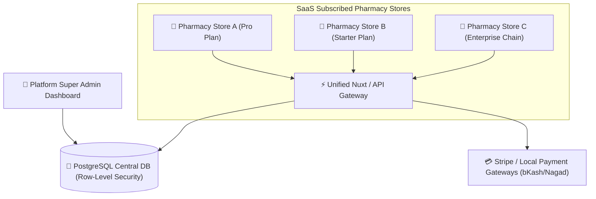
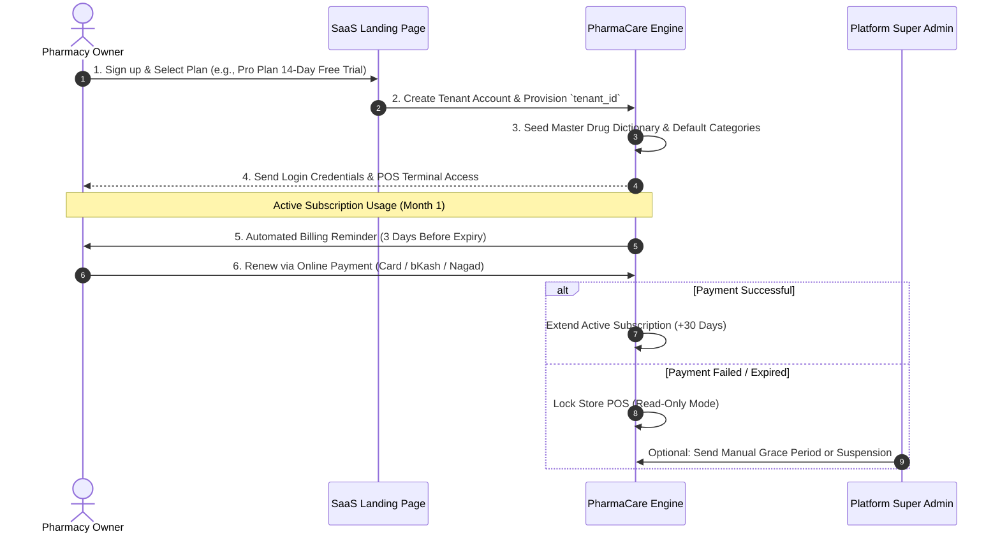

# 🚀 Multi-Tenant SaaS Pharmacy POS & ERP Platform Architecture

An enterprise-grade SaaS architecture for **PharmaCare POS & ERP**, designed for pharmacies to subscribe online while providing a **Super Admin Dashboard** for platform control, billing management, tenant isolation, and master drug catalog management.

---

## 🏗️ 1. Platform System Architecture Overview

### 🔒 Tenant Data Isolation Strategy
- **Shared Database with `tenant_id` Isolation (Recommended)**:
  - Every table (`products`, `categories`, `orders`, `inventory_batches`, `users`) includes a mandatory `tenant_id` column.
  - PostgreSQL **Row-Level Security (RLS)** guarantees Store A can never access or query Store B's data.

---

## 👥 2. User Roles & Permission Hierarchy (RBAC)

### A. 👑 Platform Super Admin (SaaS Owner)
- **Tenant Store Management**: Approve, suspend, or upgrade pharmacy subscriptions.
- **Subscription & Billing**: Set pricing plans (Monthly/Yearly), monitor revenue, handle failed payments.
- **Global Master Drug Dictionary**: Maintain a shared database of 50,000+ certified medicines (Brand name, Generic chemical, Dosage form, Manufacturer) so new subscriber pharmacies don't have to enter drug details manually.
- **Feature Flag Control**: Toggle modules per subscription tier (e.g. FEFO Expiry Tracking, Multi-branch sync, SMS alerts).

### B. 🏥 Pharmacy Store Admin (Tenant Owner)
- **Store Configuration**: Pharmacy license info, logo, receipt template, tax registration number.
- **Staff & Shift Management**: Create Cashier and Pharmacist accounts with restricted permissions.
- **Store Inventory & Pricing**: Set custom retail prices, reorder levels, and rack locations.
- **Financial & Sales Reporting**: View daily revenue, gross margins, low stock alerts, and top-selling drugs.

### C. 💊 Chief Pharmacist (Rx Compliance)
- Verify doctor's prescriptions for `Rx Required` drugs before checkout.
- Audit batch expiry dates and enforce FEFO (First-Expired, First-Out).

### D. 💻 POS Cashier / Sales Staff
- Fast POS billing register access (`[F4] Pay`, `[F8] Park Order`).
- Barcode scanning & quick search.
- Cash/Card/Mobile wallet payment processing.

---

## 💳 3. Subscription & Licensing Workflow

---

## 💎 4. Recommended Subscription Tiers

| Feature Comparison | 🟢 Starter Plan | 🟦 Pro Plan (Popular) | 🟧 Enterprise Plan |
| :--- | :---: | :---: | :---: |
| **POS Terminals** | 1 Terminal | Up to 3 Terminals | Unlimited Terminals |
| **Branch Outlets** | 1 Location | 1 Location | Multi-Branch Chain |
| **POS Cash Register** | ✅ Included | ✅ Included | ✅ Included |
| **Master Drug Catalog** | ✅ 10,000 Drugs | ✅ 50,000+ Drugs | ✅ Custom Master Catalog |
| **FEFO Batch & Expiry** | Basic | ✅ Advanced Alerts | ✅ Automated Reorder AI |
| **Rx Doctor Verification**| ✕ | ✅ Included | ✅ Included |
| **Supplier Procurement** | Manual | ✅ Purchase Orders | ✅ Automated PO Generator |
| **SMS Customer Receipts** | ✕ | ✅ 500 SMS / month | ✅ Unlimited SMS |
| **Support** | Email Support | Priority Chat Support | 24/7 Dedicated Manager |

---

## 🛠️ 5. Technical Implementation Roadmap for Nuxt 3 Architecture

### Phase 1: SaaS Multi-Tenancy Core
1. **Tenant Middleware**: Extend Nuxt middleware to detect current store slug or subdomain (`store-name.pharmacare.com` or header `X-Tenant-ID`).
2. **Auth & JWT Claims**: Embed `tenant_id` and `role` inside JWT token payload.
3. **Pinia Stores**: Ensure Pinia stores (`useCartStore`, `useProductStore`, `useCategoryStore`) filter state strictly by active `tenant_id`.

### Phase 2: Super Admin Platform Panel (`/super-admin`)
1. Store Subscriber Directory (Active, Suspended, Expired stores).
2. Subscription Plan Manager & Invoice Generator.
3. Master Medicine Drug Directory Manager.

### Phase 3: Automated Onboarding & Billing Gatekeeper
1. Public Landing & Signup Page (`/register`).
2. Payment Gateway integration (Stripe / Local Mobile Wallets).
3. Subscription Status Gatekeeper Middleware (Redirect expired stores to Renewal Page).

---

## 🎯 Summary Recommendation

For your **PharmaCare** platform, adopting a **Single Codebase, Multi-Tenant Architecture** using Nuxt 3, PostgreSQL (Row-Level Security), and Pinia will allow you to scale to **thousands of subscriber pharmacies** with zero code duplication while giving you complete Super Admin control over subscription revenue and platform health.
